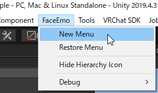
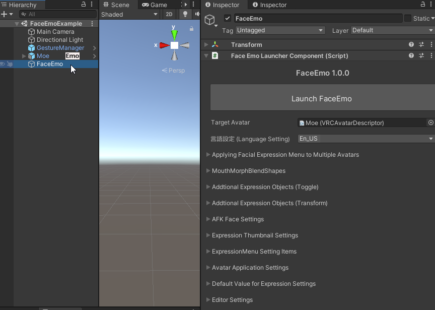
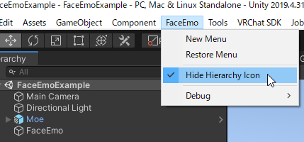

# Facial Expression Menu

The facial expression menu created with this tool is saved as an object in the scene.

- You can copy the facial expression menu by copying the object.
- Changes to the copied expression menu generally do not affect the original.
    - Changes to the animation clip are an exception, both the original and the copied ones will be affected.

The facial expression menu is newly created when you run "FaceEmo" → "New Menu" from the toolbar.

By selecting the expression menu in the hierarchy, you can launch this tool and change the settings of the facial expression menu.

When you click the icon displayed at the right end of the avatar in the hierarchy, the following processes will be carried out:

- Check all facial expression menus in the scene (sorted by name).
- If the clicked avatar matches the "target avatar", open that facial expression menu.
- If there is no facial expression menu where the clicked avatar is the "target avatar", create a new facial expression menu and open it.

You can hide the icon at the right end of the avatar by enabling "FaceEmo" → "Hide Hierarchy Icon" from the toolbar.

