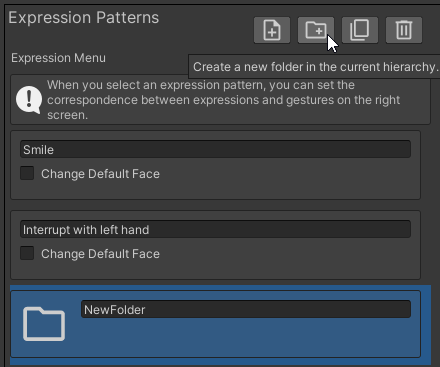
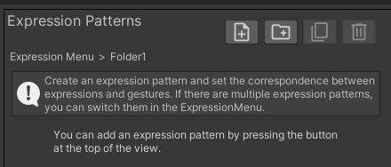
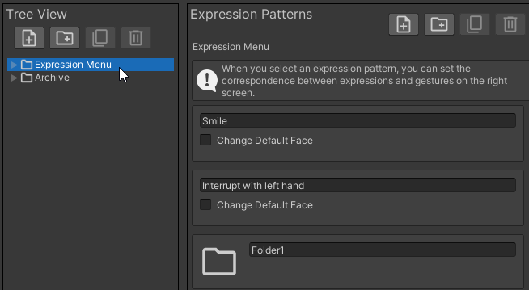
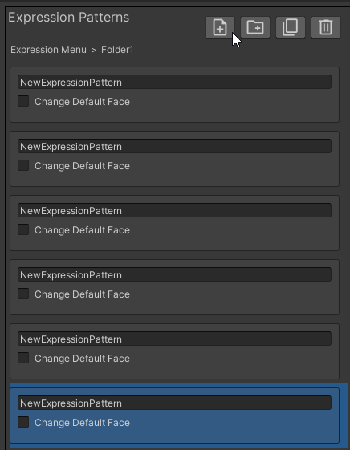
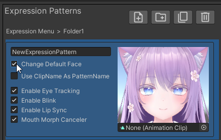
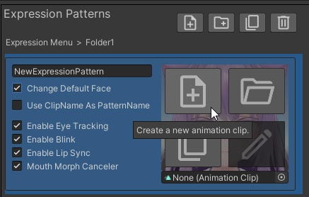
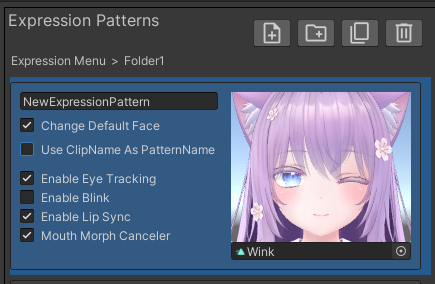
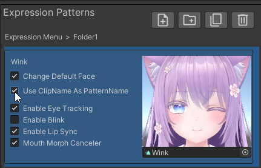
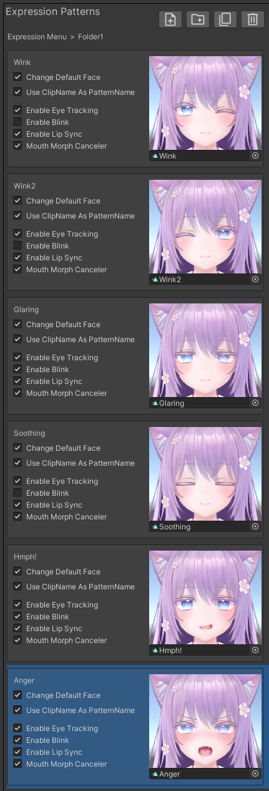
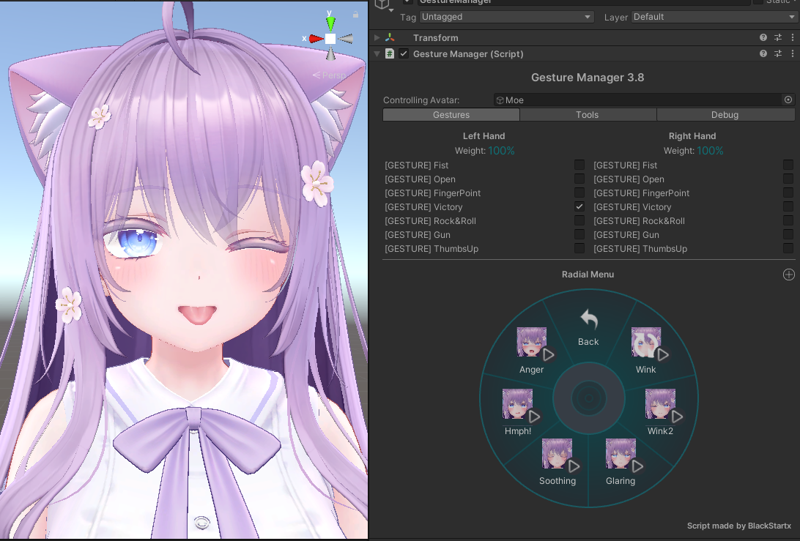

# Creating a Variety of Expression Patterns

Let's add a lot of expression patterns and make them switchable in the facial expression menu.

## Adding Folders

To create a lot of expression patterns, you need to group them, as there is a limit to the number of items that can be added to the VRChat Expression Menu.
Click on the second button from the left in the "Expression Patterns" view and try adding a folder.

You can change the name of the folder freely. This time, we will change it to "Folder1".

---

## Switching Display Hierarchy

When you double-click "Folder1", the contents of "Folder1" will be displayed in the "Expression Patterns" view.

If you want to go back to the hierarchy that was displayed earlier, click on the "Expression Menu" in the "Tree View

When you click "▶" in the "Tree View", the contents of the folder will be displayed.  
Here, if you click on "Folder1" in the "Tree View", the contents of "Folder1" will be displayed again.

:::tip
### About "Expression Menu" and "Archive"

"Expression Menu" and "Archive" are folders that are added by default.

- Expression Menu: The expression patterns and folders in this menu will be applied to the avatar
- Archive: The expression patterns and folders in this menu will not be applied to the avatar

Use the "Archive" to store things you want to temporarily remove from the avatar but don't want to delete.
:::

:::tip
Expression patterns and folders can be moved by drag & drop. 
You can also move between the Tree View and the Expression Patterns View.
:::

---

## Adding Expression Patterns

While displaying "Folder1" in the "Expression Patterns" view, add several expression modes.  

:::tip
- A folder can store up to 8 expression patterns or folders
- The "Expression Menu" can store up to 6 expression patterns or folders
- The "Archive" can store an unlimited number of expression patterns or folders
:::

After adding the expression patterns, set an expression for each expression pattern.  
This time, check "Change Default Expression" and try to make it switchable in the Expression Menu.

:::tip
Changing expressions in the Expression Menu can also be done in the [automatically generated "Emote Select" menu](../../optional-functions/emote-lock/).  
Choose between the two depending on your preferences, as changing expressions with "Change Default Expression" has the following advantages:
- It's easy to switch because you can add items to a shallow hierarchy
- You can set facial changes by hand gestures
:::

Set the facial animation for the default face in the same way as setting the facial animation in the "Expressions" view.

By checking "Use ClipName as PatternName", you can automatically set the name of the expression pattern.

Similarly, set the default face for other expression patterns.  
Please also adjust settings for blinking and other actions appropriately.

Let's set hand gestures for some expression patterns.  
Select the "Wink" expression pattern and set it in the "Expressions" view as shown in the figure below.

---

## Applying the Facial Expression Menu to the Avatar

Once you've done this, the creation of the facial expression menu is complete when you execute "Apply to Avatar".  
Upload the avatar and confirm that it behaves as follows:

- You can switch expressions in the Expression Menu
- When you make either hand Victory in the "Wink" expression pattern, the expression changes

