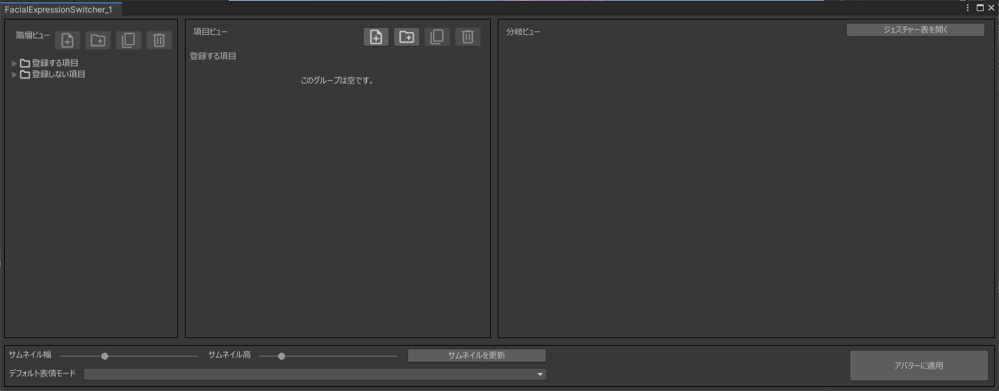
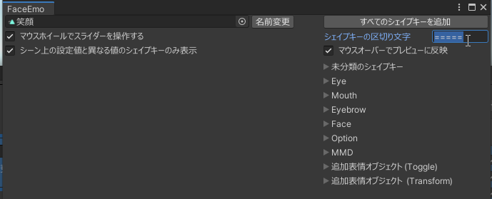
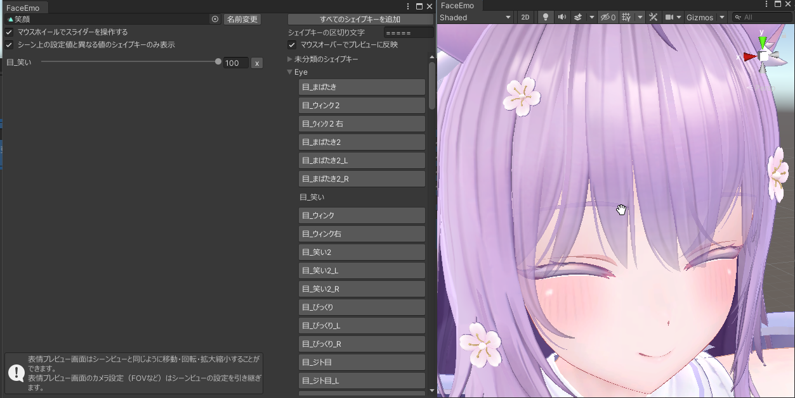
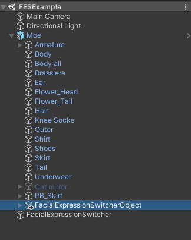

 
 # 簡単な表情メニューを作る

本ツールによる表情メニュー作成のサンプルとして、「どちらかの手のジェスチャーが Victory のとき笑顔になる」表情メニューを作ってみましょう。

## 表情メニューを新規作成する

ヒエラルキー上で右クリックし、「FacialExpressionSwitcher」→「Create」をクリックします。

「FacialExpressionSwitcher」という名前のオブジェクトが作成されるので、そのオブジェクトをクリックし、「対象アバター」にアバターのオブジェクトを指定します。

「FacialExpressionSwitcher 起動」ボタンをクリックすると、本ツールのウインドウが開きます。

## 表情モードを追加する

「項目ビュー」の一番左のボタンをクリックすると、表情モードが追加されます。

「アニメーション名をモード名として使用」のチェックを外すと表情モードの名前を入力できるようになるので、表情モードの名前を「笑顔」に変更します。

:::tip
表情モードを追加することで、Expressions Menu を使用した表情切り替えが設定できます。  
表情モードについては、[こちらのページ](../../reference/mode)で詳しく説明しています。
:::

## 分岐を追加する

表情モードをクリックして選択すると「分岐ビュー」に「分岐がありません。」と表示されるようになるので、「+」ボタンを押して分岐を追加します。

「分岐条件」の「+」ボタンを押して条件を追加し、「片手または両手が」「Victory」「と一致」と設定します。

:::tip
分岐を追加することで、ハンドジェスチャーによる表情切り替えが設定できます。  
分岐については、[こちらのページ](../../reference/branch)で詳しく説明しています。
:::

## 表情アニメーションを作成する

サムネイルにカーソルを合わせるとボタンが表示されるので、左上のボタンを押します。

表情アニメーションの保存場所を指定するウインドウが表示されるので、そのまま「保存」ボタンを押すと 「Assets」フォルダに「笑顔.anim」が保存されます。

サムネイルにカーソルを合わせ、右下のボタンを押すと本ツールの表情エディタが開きます。

:::tip
シェイプキーの区切り文字を入力することで、シェイプキーをカテゴリごとに表示することができます。

- シェイプキーの区切り文字はアバターごとに異なります
    - 「=====Eye=====」のようなカテゴリ名となっている場合、「=====」と入力してください
    - 「\*\*\*\*\*Eye\*\*\*\*\*」のようなカテゴリ名となっている場合、「\*\*\*\*\*」と入力してください

:::

「▶」をクリックするとシェイプキーのカテゴリが開き、シェイプキーの名前がリストで表示されます。  
表情アニメーションに追加したいシェイプキーをクリックするとシェイプキーが追加され、プレビューが更新されます。

- シェイプキーの値を変更したい場合、各シェイプキーのスライダーを動かすか、テキストボックスに数値を入力します

:::caution
シェイプキーを追加したとき、下記の警告が出ていないか確認してください。
- 「まばたき用シェイプキーが含まれています！」 -  まばたきアニメーションに上書きされ、表情アニメーションが正しく再生されない可能性があります
- 「リップシンク用シェイプキーが含まれています！」 -  リップシンクが正しく動かなくなる可能性があります
:::

プレビュー画面は、Unityのシーンビューと同様の操作で移動・回転・拡大縮小することが可能です。

:::tip
プレビュー画面のカメラ設定はシーンビューの設定を引き継ぎます。  
たとえば、シーンビューでFOVを変更して作業している場合、プレビュー画面にも変更したFOVが適用されます。
:::

笑顔の表情アニメーションを再生しているときにまばたきが発生すると表情が破綻してしまうので、「まばたき有効」をオフにします。

## 表情メニューをアバターに適用する

「アバターに適用」ボタンをクリックすると確認ウインドウが表示されるので、「はい」をクリックします。

「表情メニューの生成が完了しました！」と表示されれば表情メニューの作成は完了です。

- この状態でアバターをアップロードすると、Modular Avatarによって表情メニューがアバターに合成されます
- ヒエラルキーでアバターの中身を確認すると、「FacialExpressionSwitcherObject」というオブジェクトが追加されています

:::caution
### アップロードできない場合

下図のようなエラーが発生する場合、VRCSDKがModular Avatarに対応したバージョンになっていない可能性があります。  
VRCSDKとModular Avatarを最新版にアップデートしてみてください。

:::

どちらかの手のジェスチャーが Victory のとき、表情が笑顔になることを確認してください。

:::caution
### Gesture Managerでプレビューする場合の注意事項

- Gesture Manager や Modular Avatar のバージョンによっては、プレビューに表情メニューが適用されない場合があります。その場合は下記の手順を試してみてください
    - Gesture Managerのオブジェクトを選択していない状態で、UnityのPlayボタンを押す
    - Playモードに入ってから、Gesture Managerのオブジェクトを選択する
    - Gameタブでアバターがうまく表示されない場合は、Sceneタブでプレビューを確認する
- AFKモーションが再生されてしまう場合、ActionレイヤーのParametersを開いてAFKのチェックをオフにしてください

:::
